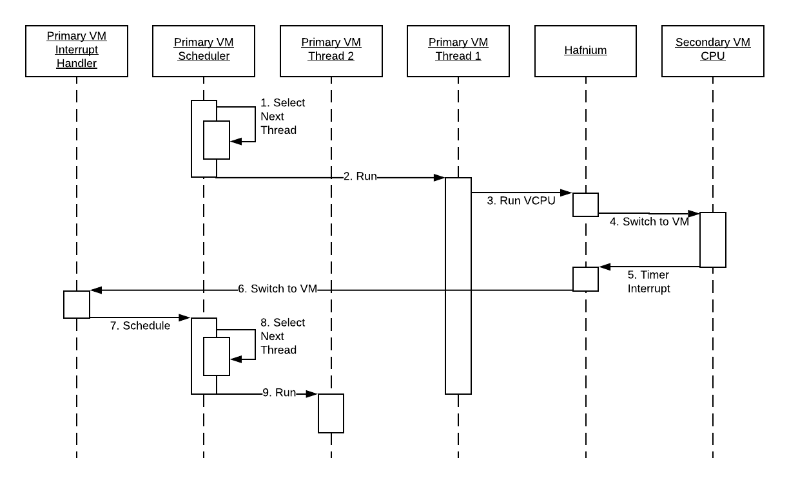

# Hafnium architecture

The purpose of Hafnium is to provide memory isolation between a set of security
domains, to better separate untrusted code from security-critical code. It is
implemented as a type-1 hypervisor, where each security domain is a VM.

On AArch64 (currently the only supported architecture) it runs at EL2, while the
VMs it manages run at EL1 (and user space applications within those VMs at EL0).
A Secure Monitor such as
[Trusted Firmware-A](https://www.trustedfirmware.org/about/) runs underneath it
at EL3.

Hafnium provides memory isolation between these VMs by managing their stage 2
page tables, and using IOMMUs to restrict how DMA devices can be used to access
memory. It must also prevent them from accessing system resources in a way which
would allow them to escape this containment. It also provides:

*   Means for VMs to communicate with each other through message passing and
    memory sharing, according to the Arm
    [Secure Partition Communication Interface (SPCI)](https://developer.arm.com/docs/den0077/a).
*   Emulation of some basic hardware features such as timers.
*   A simple paravirtualised interrupt controller for secondary VMs, as they
    don't have access to hardware interrupts.
*   A simple logging API for bringup and low-level debugging of VMs.

See the [VM interface](VmInterface.md) documentation for more details.

Hafnium makes a distinction between a **primary VM**, which would typically run
the main user-facing operating system such as Android, and a number of
**secondary VMs** which are smaller and exist to provide various services to the
primary VM. The primary VM typically owns the majority of the system resources,
and is likely to be more latency-sensitive as it is running user-facing tasks.
Some of the differences between primary and secondary VMs are explained below.

[TOC]

## Security model

Hafnium runs a set of VMs without trusting any of them. Neither do the VMs trust
each other. Hafnium aims to prevent malicious software running in one VM from
compromising any of the other VMs. Specifically, we guarantee
**confidentiality** and **memory integrity** of each VM: no other VM should be
able to read or modify the memory that belongs to a VM without that VM's
consent.

We do not make any guarantees of **availability** of VMs, except for the primary
VM. In other words, a compromised primary VM may prevent secondary VMs from
running, but not gain unauthorised access to their memory. A compromised
secondary VM should not be able to prevent the primary VM or other secondary VMs
from running.

## Design principles

Hafnium is designed with the following principles in mind:

*   Open design
    *   Hafnium is developed as open source, available for all to use,
        contribute and scrutinise.
*   Economy of mechanism
    *   Hafnium strives to be as small and simple of possible, to reduce the
        attack surface.
    *   This also makes Hafnium more amenable to formal verification.
*   Least privilege
    *   Each VM is a separate security domain and is given access only to what
        it needs, to reduce the impact if it is compromised.
    *   Everything that doesn't strictly need to be part of Hafnium itself (in
        EL2) should be moved to a VM (in EL1).
*   Defence in depth
    *   Hafnium provides an extra layer of security isolation on top of those
        provided by the OS kernel, to better isolate sensitive workloads from
        untrusted code.

## VM model

A [VM](../inc/hf/vm.h) in Hafnium consists of:

*   A set of memory pages owned by and/or available to the VM, stored in the
    stage 2 page table managed by Hafnium.
*   One or more vCPUs. (The primary VM always has the same number of vCPUs as
    the system has physical CPUs; secondary VMs have a configurable number.)
*   A one page TX buffer used for sending messages to other VMs.
*   A one page RX buffer used for receiving messages from other VMs.
*   Some configuration information (VM ID, whitelist of allowed SMCs).
*   Some internal state maintained by Hafnium (locks, mailbox wait lists,
    mailbox state, log buffer).

Each [vCPU](../inc/hf/vcpu.h) also has:

*   A set of saved registers, for when it isn't being run on a physical CPU.
*   A current state (switched off, ready to run, running, waiting for a message
    or interrupt, aborted).
*   A set of virtual interrupts which may be enabled and/or pending.
*   Some internal locking state.

VMs and their vCPUs are configured statically from a [manifest](Manifest.md)
read at boot time. There is no way to create or destroy VMs at run time.

## System resources

### CPU

Unlike many other type-1 hypervisors, Hafnium does not include a scheduler.
Instead, we rely on the primary VM to handle scheduling, calling Hafnium when it
wants to run a secondary VM's vCPU. This is because:

*   In line with our design principles of _economy of mechanism_ and _least
    privilege_, we prefer to avoid complexity in Hafnium and instead rely on VMs
    to handle complex tasks.
*   According to our security model, we don't guarantee availability of
    secondary VMs, so it is acceptable for a compromised primary VM to deny CPU
    time to secondary VMs.
*   A lot of effort has been put into making the Linux scheduler work well to
    maintain a responsive user experience without jank, manage power
    efficiently, and handle heterogeneous CPU architectures such as big.LITTLE.
    We would rather avoid re-implementing this.

Hafnium therefore maintains a 1:1 mapping of physical CPUs to vCPUs for the
primary VM, and allows the primary VM to control the power state of physical
CPUs directly through the standard Arm Power State Coordination Interface
(PSCI). The primary VM should then create kernel threads for each secondary VM
vCPU and schedule them to run the vCPUs according to the
[interface expectations defined by Hafnium](SchedulerExpectations.md). PSCI
calls made by secondary VMs are handled by Hafnium, to change the state of the
VM's vCPUs. In the case of (Android) Linux running in the primary VM this is
handled by the Hafnium kernel module.

#### Example

For example, considering a simple system with a single physical CPU, and a
single secondary VM with one vCPU, where the primary VM kernel has created
**thread 1** to run the secondary VM's vCPU while **thread 2** is some other
normal thread:

1.  Scheduler chooses thread 1 to run.
2.  Scheduler runs thread 1, and configures a physical timer to expire once the
    quantum runs out.
3.  Thread 1 is responsible for running a vCPU, so it asks Hafnium to run it.
4.  Hafnium switches to the secondary VM vCPU.
5.  Eventually the quantum runs out and the physical timer interrupts the CPU.
6.  Hafnium traps the interrupt. Physical interrupts are owned by the primary
    VM, so it switches back to the primary VM.
7.  The interrupt handler in the primary VM gets invoked, and calls the
    scheduler.
8.  Scheduler chooses a different thread to run (thread 2).
9.  Scheduler runs thread 2.

### Memory

At boot time each VM owns a mutually exclusive subset of memory pages, as
configured by the [manifest](Manifest.md). These pages are all identity mapped
in the stage 2 page table which Hafnium manages for the VM, so that it has full
access to use them however it wishes.

Hafnium maintains state of which VM **owns** each page, and which VMs have
**access** to it. It does this using the stage 2 page tables of the VMs, with
some extra application-defined bits in the page table entries. A VM may share,
lend or donate memory pages to another VM using the appropriate SPCI requests. A
given page of memory may never be shared with more than two VMs, either in terms
of ownership or access. Thus, the following states are possible for each page,
for some values of X and Y:

*   Owned by VM X, accessible only by VM X
    *   This is the initial state for each page, and also the state of a page
        that has been donated.
*   Owned by VM X, accessible only by VM Y
    *   This state is reached when a page is lent.
*   Owned by VM X, accessible by VMs X and Y
    *   This state is reached when a page is shared.

For now, in the interests of simplicity, Hafnium always uses identity mapping in
all page tables it manages (stage 2 page tables for VMs, and stage 1 for itself)
– i.e. the IPA (intermediate physical address) is always equal to the PA
(physical address) in the stage 2 page table, if it is mapped at all.

### Devices

From Hafnium's point of view a device consists of:

*   An MMIO address range (i.e. a set of pages).
*   A set of interrupts that the device may generate.
*   Some IOMMU configuration associated with the device.

For now, each device is associated with exactly one VM, which is statically
assigned at boot time (through the manifest) and cannot be changed at runtime.

Hafnium is responsible for mapping the device's MMIO pages into the owning VM's
stage 2 page table with the appropriate attributes, and for configuring the
IOMMU so that the device can only access the memory that is accessible by its
owning VM. This needs to be kept in sync as the VM's memory access changes with
memory sharing operations. Hafnium may also need to re-initialise the IOMMU if
the device is powered off and powered on again.

The primary VM is responsible for forwarding interrupts to the owning VM, in
case the device is owned by a secondary VM. This does mean that a compromised
primary VM may choose not to forward interrupts, or to inject spurious
interrupts, but this is consistent with our security model that secondary VMs
are not guaranteed any level of availability.
